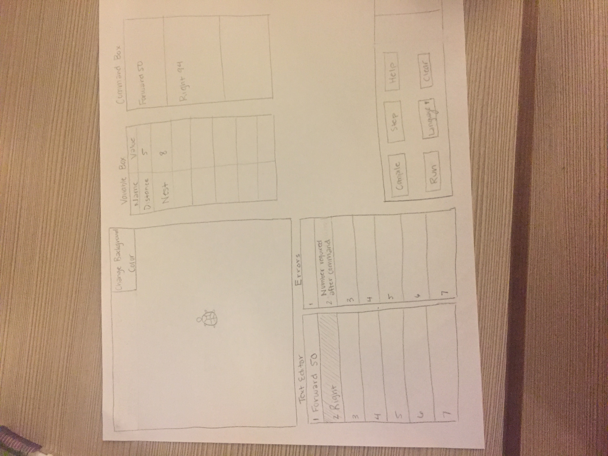

## slogo Team 15

# Team Members:
* George Bernard
* Matthew Faw
* Hannah Fuchshuber
* Kayla Schulz

# Introduction

# Design Overview

# User Interface

* Our User Interface will consist of six boxes or areas:
    * The first is the animation or turtle box, that will show the output of the commands input by the user. Inside of the turtle box, the user has a combo box with the option to change the background color. 
    * The text editor will contain the code input by the user. This can be from either the user manually typing the commands, or also from choosing an option from the command box (we will go into further detail on the command box later). If the user is stepping through the program, the last executed line will be highlighted. Additionally, if an error at compile time due to something in the text editor, the line will be highlighted in red. 
    * This transitions in the box adjacent to the text editor: the error box. The error box is a mirror of the text editor box, expect it will only contain text with a compile or run error. At that time, it will populate the box with an error message at the line that caused the error. If the user tries to compile an empty text editor, the first line of the error box will display an error message telling the user to populate the text editor with a command.
    * The variable box will hold the names and values of the defined variables. The user will be able to click into each line in the variable box and update the value. 
    * The box to the right of the variable box is the command box. The command box holds the most recently used (MRU) commands. These will basically be buttons that the user can click that will populate the text editor with a full command. The command box should update each time new code is successfully run. Later down the line, we see the user having the ability to delete each element in the command box at his/her discretion. There would be a little red box with an ‘X’ in the corner of each command that would allow the user to remove that command from the MRU stack. 
    * Finally, the toolbar will contain many of the buttons that allow the user to interact with the program. This will include the run, step, clear, language (combo box), help, and compile buttons.

# API Details

# API Example Code

# Design Considerations
* Before the team can come to a complete design solution, we need to reach a consensus on what specific information will be passed between the front-end and the back-end. We have discussed passing one object back and forth through the controller, allowing for flexibility in what is included in the object and later extension.

# Team Responsibilities
* We split the team into two parts as recommended: front-end and back-end. Matthew and Hannah will be responsible for the back-end while George and Kayla will be responsible for the front-end. 
In splitting up front-end, George and Kayla will do some pair programming to begin the creation of the sub-components of the view. In terms of individual responsibilities
though, George will handle more of the controller implementation and the communication between the front-end and the back-end. Kayla will work on more of the visual